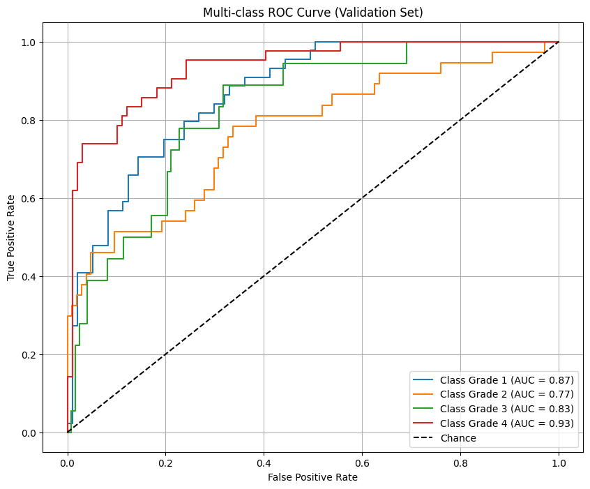
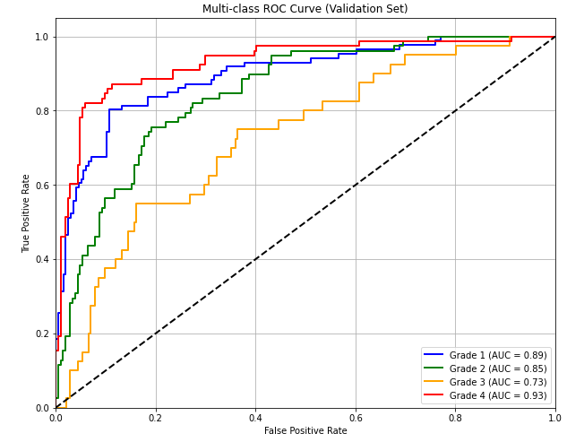

# Swin-ResNet-Ensemble-for-Custom-DFU-Grading/Classification-(1-4)
This project implements an ensemble of Swin Transformer and ResNet models for grading diabetic foot ulcers (DFU) into four severity levels. The system achieves robust and clinically relevant classification performance by leveraging the complementary strengths of CNNs and Transformers. 
## ResNet50 Multiclass ROC Curve

## ResNet50 + ViT Ensemble Learning

## Swin Transformer

